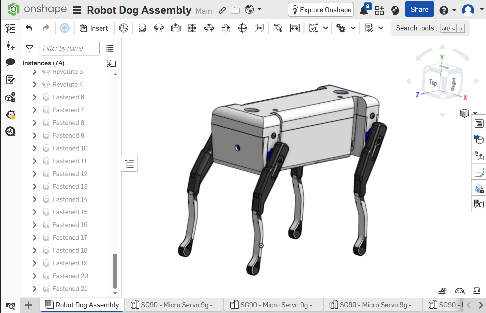
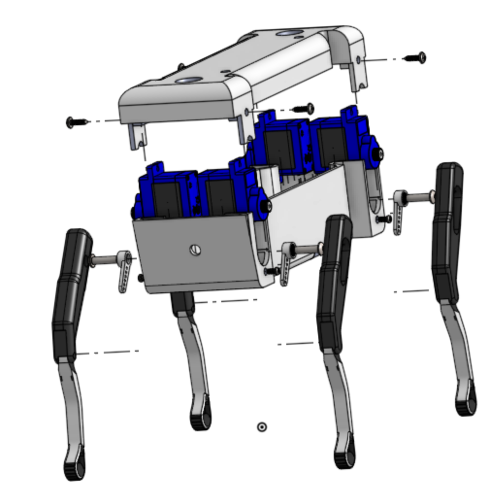

# Task 04 - Robot Dog Assembly and Exploded View

## Project Preview

### Final Assembly

### Exploded View

## Project Description

In this task I assembled a robot dog using Onshape

The files were already given but every part was separated, so I had to insert the parts and connect them together

After I finished the robot I made an exploded view to show the parts and where every part goes

## Parts Used

- Main body
- Body cover
- 4 SG90 servo motors
- 4 servo horns
- 2 left legs
- 2 right legs
- Cover screws
- Servo screws
- Servo horn screws

## Assembly

I started with the main body and fixed it so it will not move while I work

The body was one part and it was easy to use, but the servo was different because every servo had many small parts

At first when I tried to move the servo some parts moved alone and the servo separated. I used `Group` for all the parts of each servo and after that it moved like one part

I added four servos inside the body and used `Fastened Mate` to put every servo in its corner

Then I added the cover and the four legs. I used `Revolute Mate` for the legs because the legs need to rotate around the servo shaft

After that I added the servo horns and all the screws

## Mates Used

- `Group` for the parts inside each servo
- `Fastened Mate` for the servos, cover, servo horns and screws
- `Revolute Mate` for the four legs

I learned that one `Fastened Mate` can fix the part completely. Before that I was trying to use more Mates and the assembly was getting confusing

## Motors and Movement

The robot uses four SG90 servo motors

Every servo controls one leg and the servo horn connects the servo movement to the leg

The legs can rotate forward and backward. The four servos need to move in the correct order so the robot does not move all the legs at the same time and lose balance

## Simple Walking Algorithm

1. Turn on the robot

2. Move all servos to the middle standing angle

3. Move the front left leg and the back right leg forward

4. Wait for a short time

5. Return the two legs to the standing angle

6. Move the front right leg and the back left leg forward

7. Wait again then return them to the standing angle

8. Keep repeating the same movement while the robot is walking

9. When the robot stops return all the legs to the standing angle

The exact servo angles can be changed after testing. Some servo directions may also need to be reversed because the servos are facing different sides

## Exploded View

After finishing the assembly I created the exploded view

I moved the cover, servos, legs, servo horns and screws away from the main body. I also kept the explode lines because they help to show where every part should be installed

## Onshape Link

[View the Robot Dog Assembly and Exploded View](https://cad.onshape.com/documents/57cc1fdfeb14bfde529807fd/w/78d8b1576243eec1d1117c34/e/306058162401dfeb45ebad88?renderMode=0&rightPanel=explodedViewPanel&uiState=6a6fabfd1660821f534dffc0)

## Files

- `robot-dog-assembly.png`
- `robot-dog-exploded-view.png`
- `README.md`
