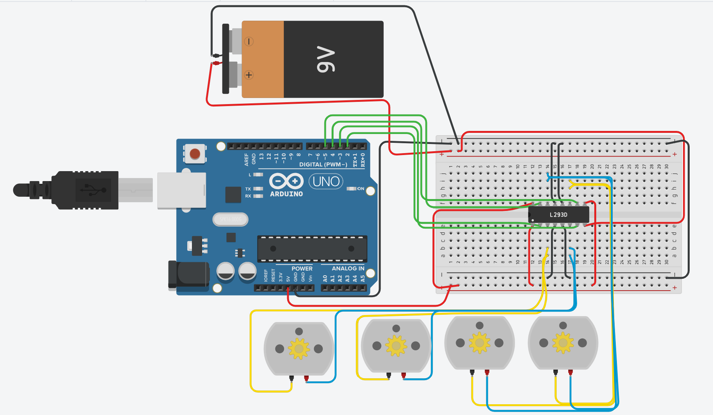

# Task 02 - Four DC Motors with L293D

## Circuit

## Project Description

This task is a simulation for controlling four DC motors using Arduino and L293D motor driver, the motors move forward, backward, right and left for specific times.

## Components

- Arduino Uno
- L293D Motor Driver
- 4 DC Motors
- Breadboard
- 9V Battery
- Jumper Wires

## How It Works

1. All motors move forward for 30 seconds.
2. All motors move backward for 60 seconds.
3. The motors turn right and left alternately for 60 seconds.
4. The sequence repeats again.

The first two motors are connected together as one side. The other two motors are connected together as the second side.

## Arduino Pins

- Pin 2 and Pin 3 control the first two motors.
- Pin 4 and Pin 5 control the other two motors.

## Tinkercad Simulation

[Open the Tinkercad circuit](https://www.tinkercad.com/things/jirnXpDleud/editel?returnTo=%2Fdashboard&sharecode=CTa98GsZhSv6rjfbRb-CV1sdbFEKac1rYubHdN_pjpQ)

## Files

- `task_02_four_dc_motors.ino` - Arduino code
- `circuit.png` - Circuit screenshot
