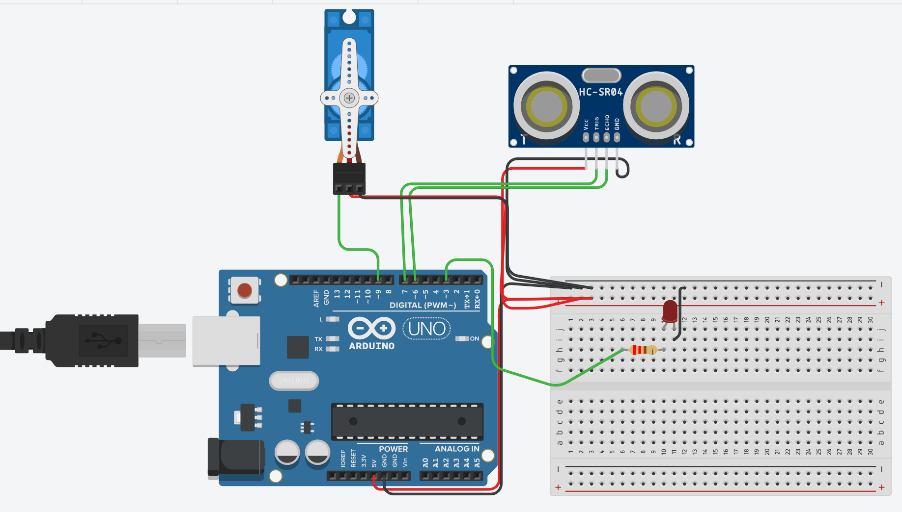
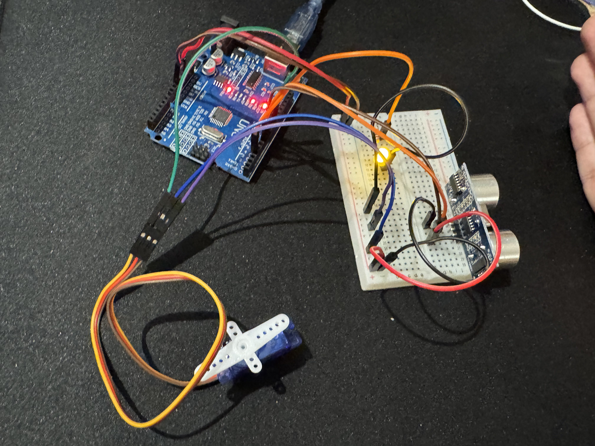

# Task 03 - Servo Motor with Ultrasonic Sensor

## Project Description

This project uses an Arduino Uno with an ultrasonic sensor and one servo motor with LED.

When an object is 10 cm or closer, the servo moves to 90 degrees and the LED turns on. When the object moves away, the servo returns to 0 degrees and the LED turns off.

In any project, we should use the simulation to be sure that the project is satisfied. Use Tinkercad first to test the circuit and code. After that, I made the real project using the components.

## Components

- Arduino Uno
- HC-SR04 ultrasonic sensor
- Micro servo motor
- LED
- 220 ohm resistor
- Breadboard
- Jumper wires
- USB cable

## Pin Connections

- Ultrasonic TRIG: Pin 7
- Ultrasonic ECHO: Pin 6
- Servo signal: Pin 9
- LED: Pin 3
- VCC: 5V
- GND: GND

## How It Works

1. The ultrasonic sensor measures the distance.
2. If the distance is 10 cm or less, the servo moves to 90 degrees.
3. The LED turns on when the object is detected.
4. If the distance is more than 10 cm, the servo returns to 0 degrees.
5. The LED turns off.

## Circuit Diagram

[Tinkercad Simulation](https://www.tinkercad.com/things/gofDclfFjM7/editel?returnTo=%2Fdashboard&sharecode=o4AN8SSsr4HiVdOpppByF-vMKmF5u0f6UmojYOr1Btk)

## Physical Project

[Watch the project video](https://drive.google.com/file/d/1JSqdasoI7sxzbO8sjCQsN7uzbpgmgKpo/view?usp=sharing)

## Testing

I changed the activation distance from 10 cm to 15 cm. I also changed the servo angle from 90 degrees to 45 degrees.

The servo moved to 45 degrees when the object was around 12 cm away. After the test, I returned the final values to 10 cm and 90 degrees.

## Files

- `servo_ultrasonic_sensor.ino`
- `tinkercad-circuit.png`
- `physical-project.jpg`
- `README.md`
