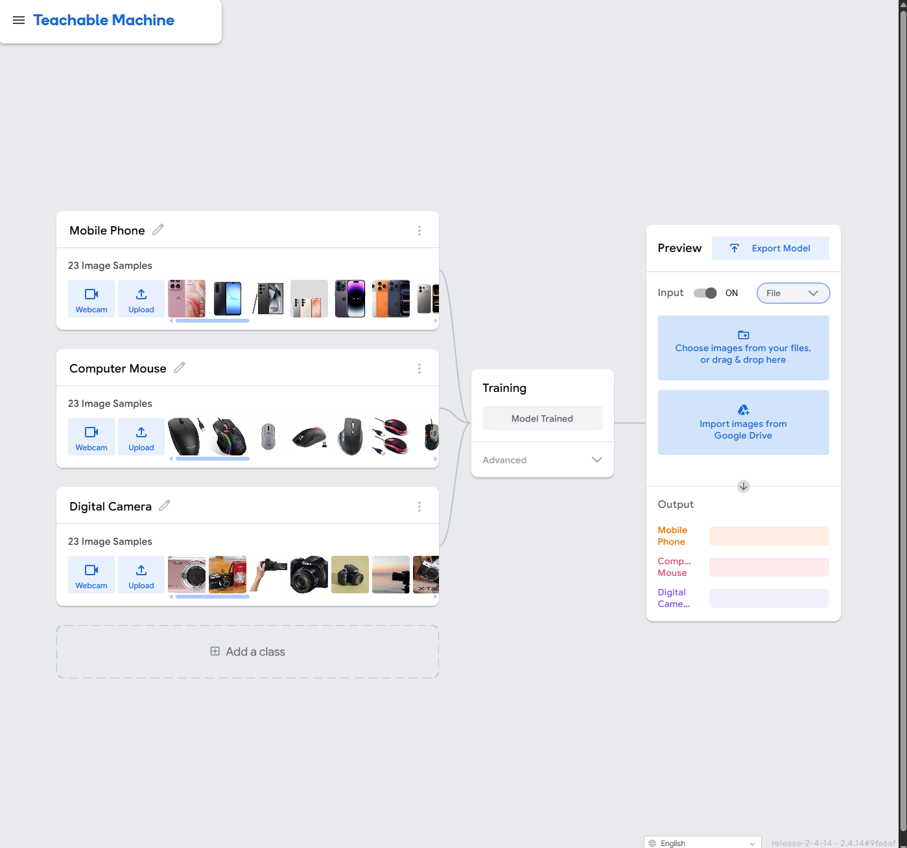
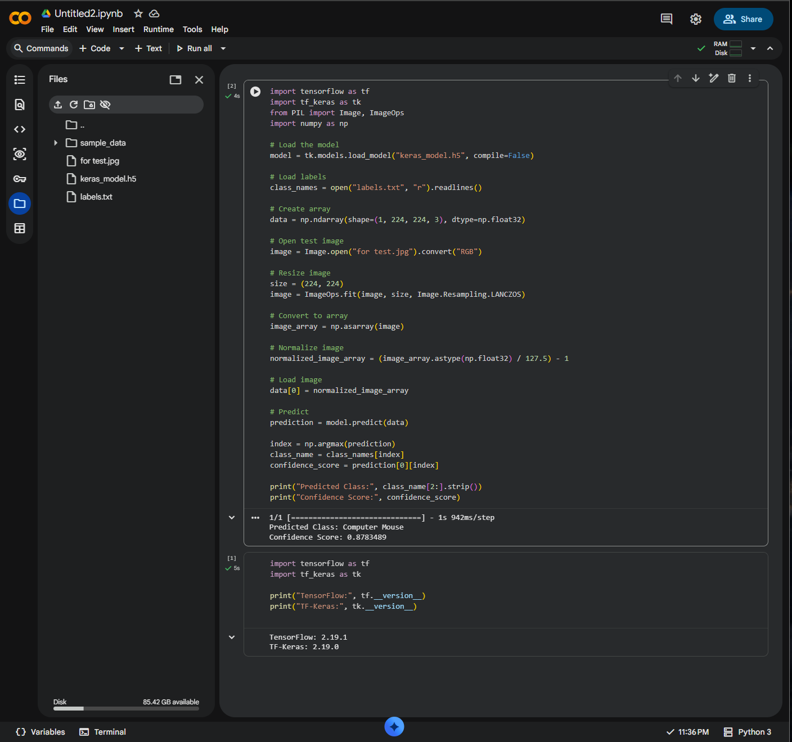

# Task 01 - Image Classification using Teachable Machine

## Project Preview




The model was trained to recognize three different object classes:

- Mobile Phone
- Computer Mouse
- Digital Camera

---

## Project Description

This task uses Google's Teachable Machine to build an image classification model.

The model was trained using three classes and exported as a TensorFlow Keras model. A Python script was then used to load the model and classify a new input image.

---

## Training Data

Each class contains 23 images.

Classes:

- Mobile Phone
- Computer Mouse
- Digital Camera

---

## Model

The trained model was exported in TensorFlow → Keras format.

Files used:

- keras_model.h5
- labels.txt

---

## Python Script

The Python script is very simple.

First, it loads the trained model
then it reads the labels
after that, I give it an image to test
the model predicts which class the image belongs to
Finally, it shows the predicted class and the confidence score.

---

## Test Result

The model was tested using an unseen image.

Example output:

```
Predicted Class: Computer Mouse
Confidence Score: 0.8783
```

The model correctly identified the object.

---

## Files

- image_classification.py
- keras_model.h5
- labels.txt
- for test.jpg

---

## Notes

The model successfully classified the three trained object classes using Teachable Machine and TensorFlow Keras.
