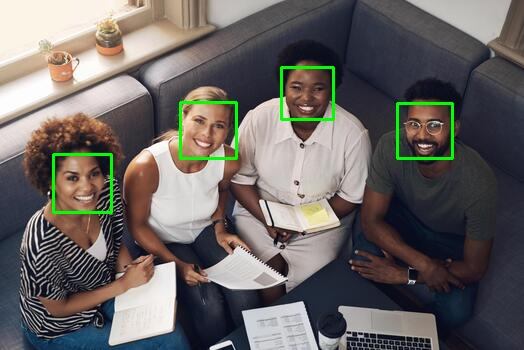

# Task 02 - Face Recognition using OpenCV

## Project Description

This project uses OpenCV to detect faces in an image.

The program reads the image, changes it to grayscale, and uses a Haar Cascade file to find the faces. Then it draws a green rectangle around every detected face.

## Result

## Steps

1. I opened a new folder in VS Code and installed OpenCV.
2. I downloaded an image with four people and added it with the code.
3. I used the Haar Cascade file to find the faces.
4. The code detected the faces and drew green boxes around them.
5. I saved the final result.

## Files

- `face_recognition.ipynb` - The Python code.
- `Face.jpg` - The original image.
- `face_detection_result.jpg` - The final result.
- `README.md` - Project explanation.

## Tools

- Python
- OpenCV
- Visual Studio Code
- Haar Cascade
