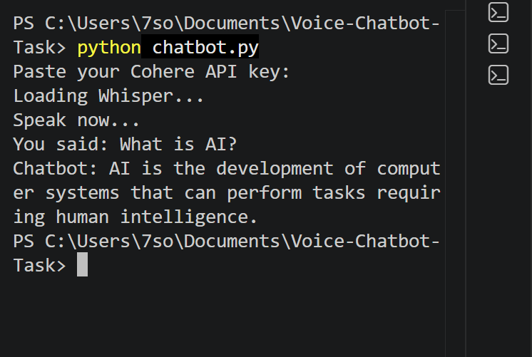

# Task 03 - Voice Chatbot

## Project Description

This task is a simple voice chatbot using Python.

The program records my voice for 5 seconds. Whisper converts my voice into text. Cohere generates an answer, then gTTS converts the answer into audio and plays it.

## How It Works

1. Record the voice from the microphone.
2. Convert the voice into text using Whisper.
3. Send the text to Cohere.
4. Get an answer from Cohere.
5. Convert the answer into audio using gTTS.
6. Play the audio response.

## Tools Used

- Python
- Anaconda
- Visual Studio Code
- OpenAI Whisper
- Cohere API
- gTTS
- SoundDevice

## Steps

1. I created a new environment in Anaconda.
2. I installed the required libraries.
3. I tested voice to text using Whisper.
4. I tested the Cohere API.
5. I tested text to audio using gTTS.
6. I combined all parts in one Python file.
7. I tested the final chatbot.

## How to Run

Install the libraries:

```bash
pip install -r requirements.txt

```

Run the program:

```bash
python chatbot.py
```

Paste the Cohere API key when the program asks for it. Speak after `Speak now...` appears.

## Result



The chatbot converted my voice into text, answered the question, and played the answer as audio.

## Files

- `chatbot.py` - Main Python code.
- `requirements.txt` - Required libraries.
- `chatbot-result.png` - Final result screenshot.
- `reply.mp3` - Generated audio response.

## Note

The Cohere API key is not saved in the code because it is private.
