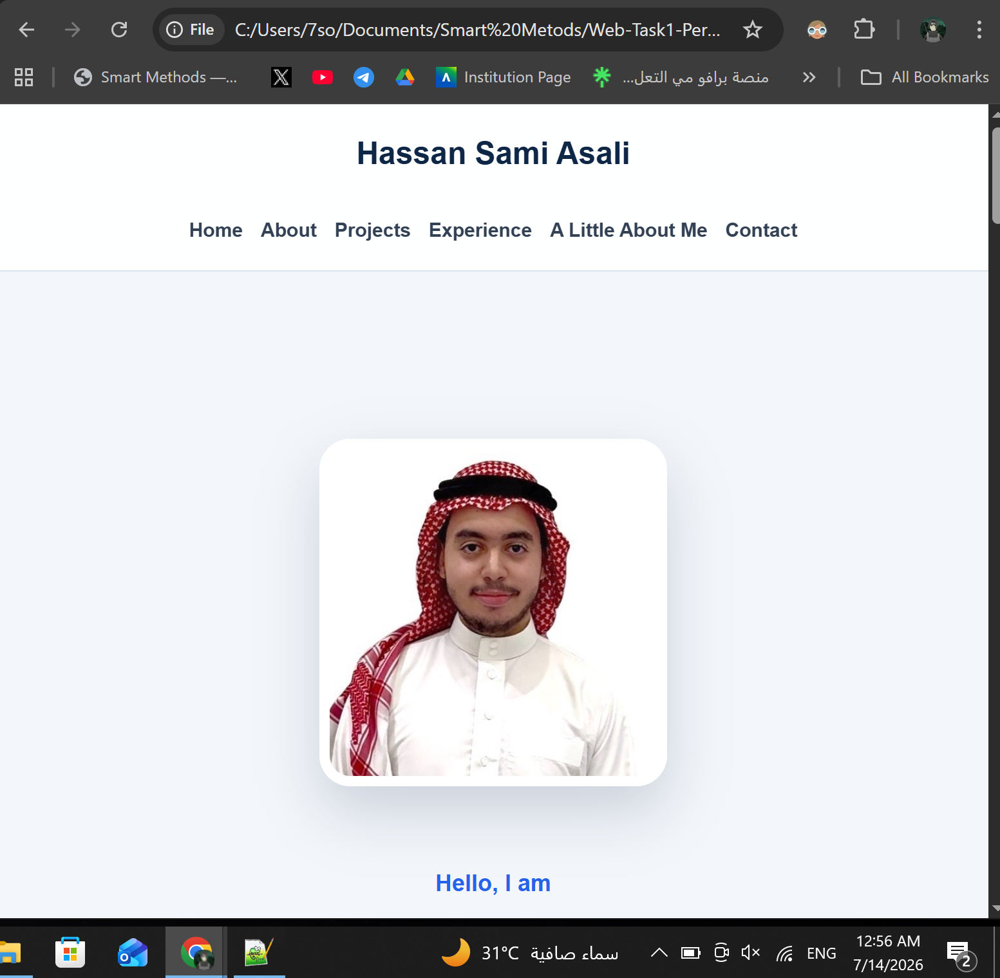

# Personal Website

## Website-Preview



---

## About The Project

This is my first personal website using HTML and CSS.

I made it to introduce myself, show some of my university projects, share a little about me, and add my contact information.

---

## Website Sections

- Home
- About
- Projects
- Experience
- A Little About Me
- Contact

---

## Technologies Used

- HTML
- CSS

---

## Files

```
Task-01-Personal-Website/
│
├── index.html
├── style.css
├── website-preview.png
└── images/
    ├── profile.jpg
    ├── emergency-car.jpg
    └── delivery-box.jpg
```

---

## Live Website

[Visit My Website](https://hassan332sa.infinityfreeapp.com/)

---

## Notes

This project was created as part of the Smart Methods Summer Training program.
