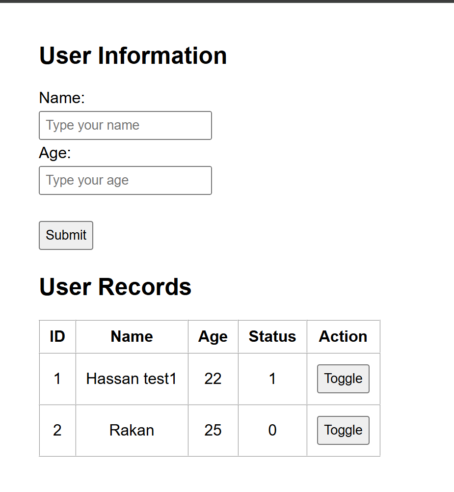

# Task 02 - User Status Database

## Website Preview

## Project Description

This task is just a simple webpage connected to a MySQL database.

The user can enter his name and his age using the form. The data will be saved in the database and displayed in the table below the form.

Each record has a status value. The Toggle button changes the status between 0 and 1.

## Languages Used

- HTML
- CSS
- PHP
- MySQL

## Database Structure

The database table contains four columns:

- ID
- Name
- Age
- Status

The ID is created automatically, and the default status is 0.

## How It Works

1. The user enters a name and age
2. The form sends the data to PHP
3. PHP saves the data in MySQL
4. PHP reads all records from the database
5. The records appear in the webpage table
6. The Toggle button changes the status between 0 and 1

## Files

- `index.php` - Form, database connection, records table, and Toggle function.
- `style.css` - Simple webpage styling.
- `website-preview.png` - Screenshot of the working webpage.

## Live Website

[Open Task 02 Website](https://hassan332sa.infinityfreeapp.com/task2/)
