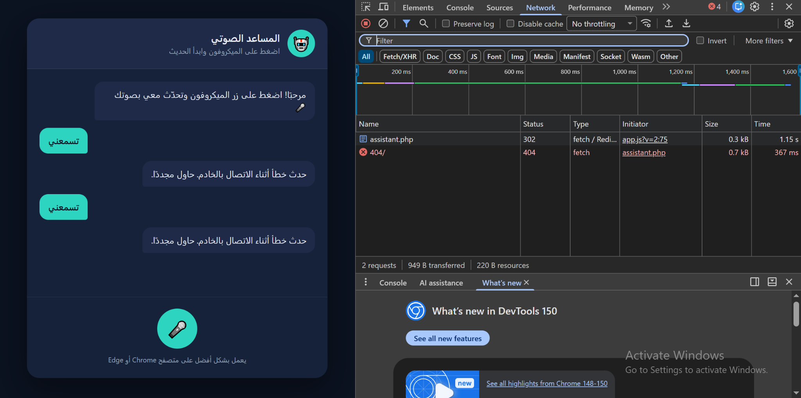
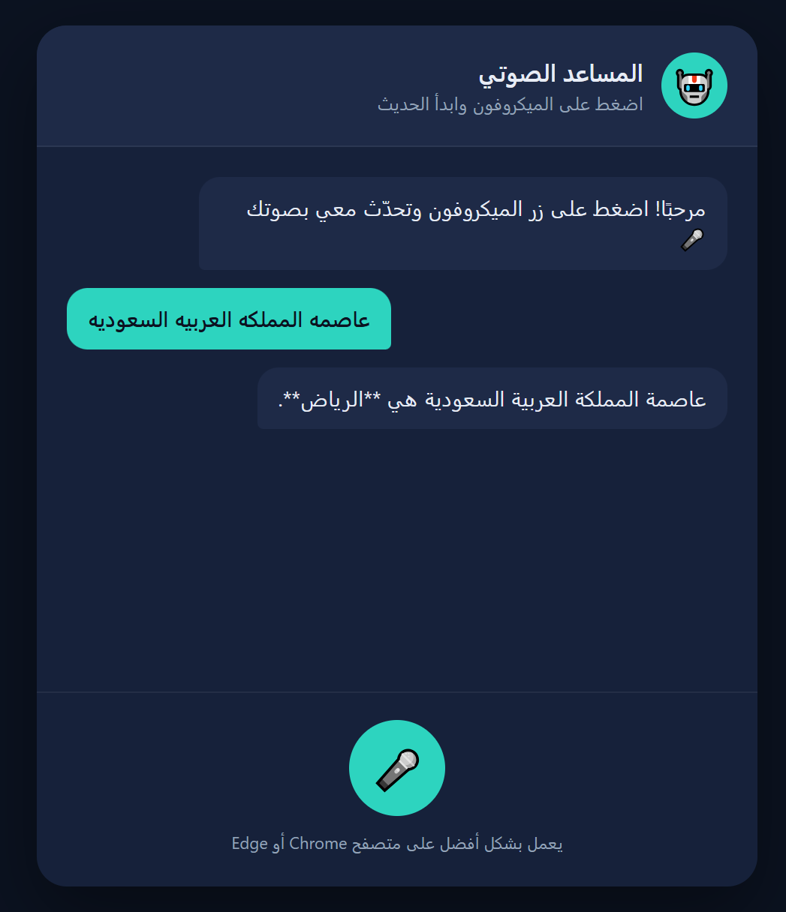

# Task 03 - Voice Assistant Website

## Project Preview

### Before Fixing

At first, the microphone was working and my voice changed into text, but the website could not connect to the PHP server.



### Final Result

After four hours of work, I fixed the files and the server connection. The website then received my voice, and Gemini answered correctly.



## Project Description

This task was to upload a voice assistant website to a server and fix the PHP connection. It uses HTML, CSS, JavaScript, and PHP, and it also uses the Gemini API to generate the answers.

The website is in Arabic and uses Arabic voice recognition.

## How It Works

1. Press the microphone button.
2. The browser listens to my voice.
3. My voice changes into text.
4. JavaScript sends the text to the PHP file.
5. PHP sends the question to Gemini.
6. Gemini returns an answer.
7. The answer appears on the website and is read aloud.

## Tools Used

- HTML
- CSS
- JavaScript
- PHP
- Gemini API
- InfinityFree
- Chrome Developer Tools
- GitHub

## Uploading the Website

I created a folder called `voice-assistant` inside the `htdocs` folder on InfinityFree and uploaded the HTML, CSS, JavaScript, PHP, and configuration files. I also created an `api` folder for the PHP backend file.

## Problems and Fixes

### 1. PHP Filename Problem

The original PHP file was called `chat.php`, but InfinityFree blocked it because the word `chat` is not allowed in some filenames. It returned a `403 Forbidden` error.

So I renamed the file to:

```text
assistant.php
```

Then I changed the backend path in `app.js` to:

```javascript
const BACKEND_URL = "api/assistant.php";
```

### 2. Server Request Problem

The website was sending the request as JSON, and InfinityFree redirected the request with status `302`. It then went to a `404` page.

So I changed the JavaScript request to normal form data:

```javascript
headers: { "Content-Type": "application/x-www-form-urlencoded" },
body: new URLSearchParams({ prompt }).toString(),
```

I also changed the PHP file to receive the text using:

```php
$prompt = isset($_POST['prompt']) ? trim($_POST['prompt']) : '';
```

### 3. Old Gemini Model

The PHP file was using the old model:

```text
gemini-2.0-flash
```

This model was no longer available, so I changed it to:

```text
gemini-3.5-flash-lite
```

### 4. Missing API Key

The first uploaded `config.php` file did not contain the Gemini API key.

So I added the key to the server copy of `config.php`. I did not add the real key to GitHub for security.

### 5. JavaScript Cache

After uploading `app.js`, the website was still loading the older file.

I added a version number to the JavaScript link:

```html
<script src="app.js?v=3"></script>
```

This forced the browser to load the updated file.

## Testing

I first tested the website interface and microphone locally.

After uploading the files, I used the Network tab in Chrome Developer Tools to check the server requests.

The final test was in Arabic. I asked about the capital of Saudi Arabia, and Gemini answered that the capital is Riyadh.

## Project Structure

```text
Task-03-Voice-Assistant/
├── api/
│   └── assistant.php
├── .htaccess
├── app.js
├── config.php
├── index.html
├── style.css
├── voice-assistant-error-before-fix.png
├── voice-assistant-working-after-fix.png
└── README.md
```

## Important Note

The `config.php` file uploaded to GitHub does not contain the real API key.

The real API key is only stored in the server copy.

## Links

- [Live Voice Assistant Website](https://hassan332sa.infinityfreeapp.com/voice-assistant/)
- [Gemini API](https://ai.google.dev/gemini-api/docs)
- [Google AI Studio](https://aistudio.google.com/)
- [InfinityFree](https://www.infinityfree.com/)
- [Back to Web and Mobile Tasks](../)
